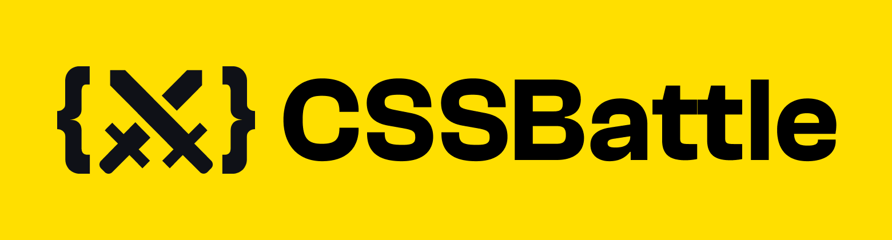

<h1 align="center">Hi 👋, I'm CodedByLu</h1>

<h2 align="center">Your favorite frontend superhero from Earth</h2>

<h3 align="left">Connect with me:</h3>
 

  <!-- Youtube -->
  &nbsp;&nbsp;&nbsp;&nbsp;&nbsp;

  <!-- Instagram -->
  &nbsp;&nbsp;&nbsp;&nbsp;&nbsp;

  <!-- CSSBattle -->
  &nbsp;&nbsp;&nbsp;&nbsp;&nbsp;

  <!-- Codewars -->
  

<h3 align="left">Languages and Tools:</h3>
 

 

  <!-- Figma -->
  &nbsp;&nbsp;&nbsp;&nbsp;&nbsp;

  <!-- HTML -->
  &nbsp;&nbsp;&nbsp;&nbsp;&nbsp;

  <!-- CSS3 -->
  &nbsp;&nbsp;&nbsp;&nbsp;&nbsp;

  <!-- SASS -->
  &nbsp;&nbsp;&nbsp;&nbsp;&nbsp;
  
  <!-- JavaScript -->
  &nbsp;&nbsp;&nbsp;&nbsp;&nbsp;

  <!-- C# -->
  &nbsp;&nbsp;&nbsp;&nbsp;&nbsp;

  <!-- React -->
  &nbsp;&nbsp;&nbsp;&nbsp;&nbsp;

  <!-- Webpack -->
  &nbsp;&nbsp;&nbsp;&nbsp;&nbsp;
  
  <!-- Android Studio -->
  &nbsp;&nbsp;&nbsp;&nbsp;&nbsp;

  <!-- Unity -->
  &nbsp;&nbsp;&nbsp;&nbsp;&nbsp;

  <!-- Git -->
  &nbsp;&nbsp;&nbsp;&nbsp;&nbsp;

  <!-- NodeJS -->
  &nbsp;&nbsp;&nbsp;&nbsp;&nbsp;

  <!-- Linux -->
  &nbsp;&nbsp;&nbsp;&nbsp;&nbsp;

<h3 align="left">Support:</h3>
 

  

  

 

<picture>
  <source media="(prefers-color-scheme: dark)" srcset="https://raw.githubusercontent.com/CodedByLu/CodedByLu/output/pacman-contribution-graph-dark.svg">
  <source media="(prefers-color-scheme: light)" srcset="https://raw.githubusercontent.com/CodedByLu/CodedByLu/output/pacman-contribution-graph.svg">
  
</picture>
